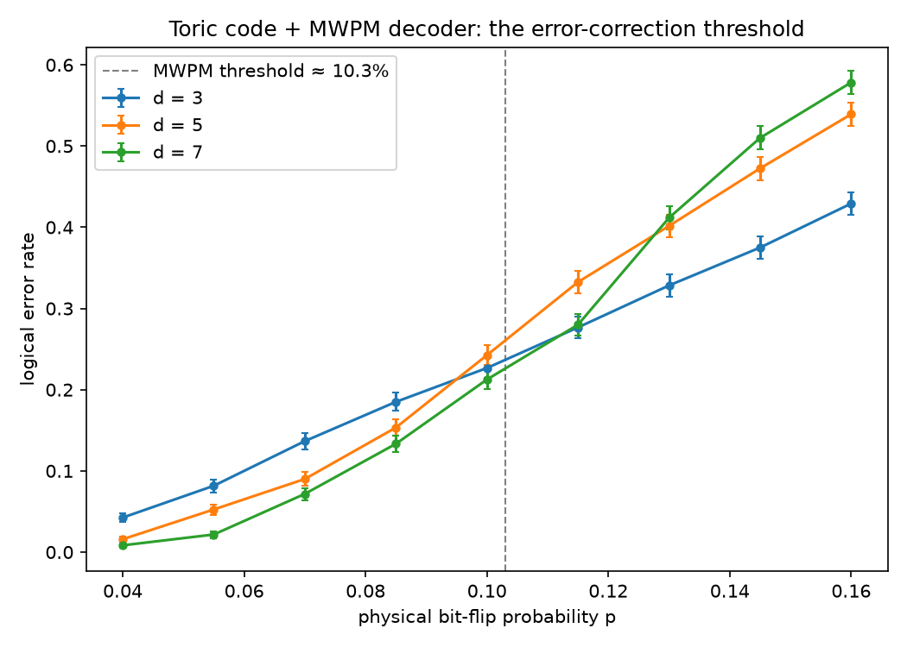

# qeclab


**Toric-code quantum error correction with a minimum-weight perfect-matching
decoder — including the threshold experiment that makes surface codes the
leading fault-tolerance architecture.**



An L×L torus carries 2L² physical qubits (one per edge). Independent
bit-flip errors light up plaquette syndromes; the decoder pairs the defects
with blossom-algorithm minimum-weight matching over toric Manhattan
distances and flips a shortest path between each pair. Logical failure is
decided homologically: a syndrome-free residual is an error iff it winds the
torus (odd overlap with a logical-Z loop). By CSS duality, phase-flips are
the same problem on the dual lattice.

## What the tests prove

- **Exact code guarantees, exhaustively:** every weight-1 error on d = 3 and
  d = 5, and *all 1,225 weight-2 errors* on d = 5, are corrected with zero
  logical failures — the ⌊(d−1)/2⌋ guarantee, checked case by case rather
  than sampled.
- **Homological bookkeeping:** every single edge error lights exactly two
  plaquettes; vertex stars (the X-stabilizers) are invisible to both the
  syndrome *and* the logical-parity check — including stars straddling the
  parity-check row/column; a noncontractible loop has no syndrome yet flips
  a logical.
- **The threshold, both sides:** at p = 5% (below the ~10.3% MWPM
  threshold) distance 7 must beat distance 3 decisively; at p = 20% the
  d = 7 code fails ≥ 30% of the time — more qubits stop helping.
- Path construction is self-consistent: `apply_path(a, b)` creates defects
  exactly at {a, b}, with wraparound chosen per-axis.

The subtlest bug this suite caught during development: using plaquette
boundaries (rather than vertex stars) as the "invisible loop" fixture. Both
are closed loops geometrically, but only star products are X-stabilizers —
plaquette-boundary X-loops are detectable. If your homology conventions are
off by a dual, the test fails immediately.

## Install & use

```bash
pip install -e ".[dev]"
```

```python
import numpy as np
from qeclab import logical_error_rate, run_trial

print(logical_error_rate(size=5, p=0.08, n_trials=2000))
```

Regenerate the threshold plot (a few minutes): `python examples/threshold.py`.

## Tests

```bash
pytest -q     # 13 tests, ~3 s
ruff check .
```

## References

Dennis, Kitaev, Landahl & Preskill, *Topological quantum memory*,
J. Math. Phys. 43, 4452 (2002).

## License

MIT
